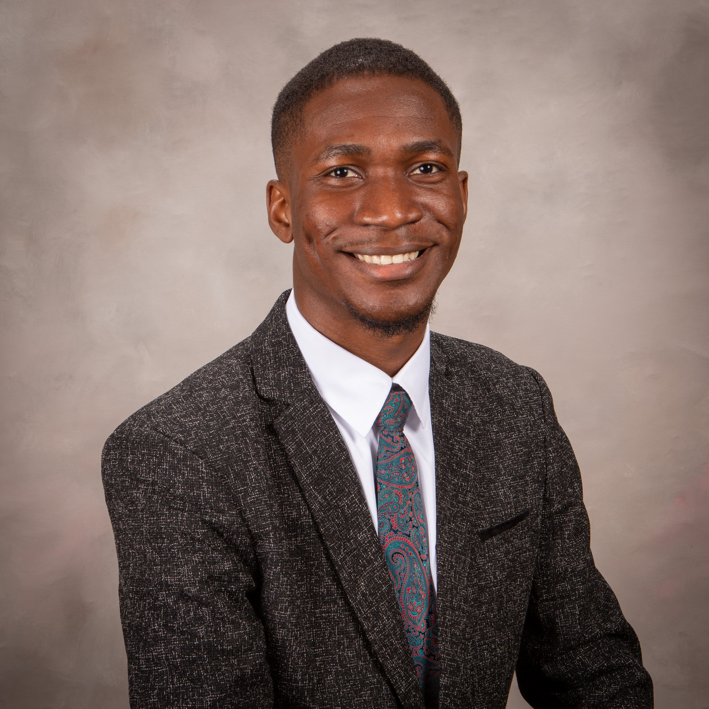

::: {.image-banner}

:::

::: {.content-section}

# People

## Principal Investigator

::: {.person-card}

::: {.person-photo}

:::

::: {.person-info}
### Christian Santoni, Ph.D.

Assistant Professor  
Department of Mechanical Engineering  
North Carolina A&T State University 

  <a class="profile-button" href="https://www.linkedin.com/in/christian-santoni-pr" target="_blank" rel="noopener">
    in LinkedIn
  </a>

  <a class="profile-button" href="https://orcid.org/0000-0002-7578-2161" target="_blank" rel="noopener">
    iD ORCID
  </a>

  <a class="profile-button" href="https://scholar.google.com/citations?user=sIqvB2oAAAAJ" target="_blank" rel="noopener">
    G Scholar
  </a>

<!--
::: {.profile-links}
[LinkedIn](https://www.linkedin.com/in/christian-santoni-pr){.profile-button}
[ORCID](https://orcid.org/0000-0002-7578-2161){.profile-button}
[Google Scholar](https://scholar.google.com/citations?user=sIqvB2oAAAAJ){.profile-button}
:::
[LinkedIn](https://www.linkedin.com/in/christian-santoni-pr) | 
[ORCID](https://orcid.org/0000-0002-7578-2161) | 
[Google Scholar](https://scholar.google.com/citations?user=sIqvB2oAAAAJ)
-->

Dr. Santoni's research focuses on computational fluid dynamics, large-eddy simulation, environmental and atmospheric flows, wind energy, machine learning, and high-performance computing. His work combines physics-based modeling, in-house code development, and data-driven approaches for complex flow and energy systems.

**Research interests:** computational fluid dynamics, turbulence, large-eddy simulation, wind energy, environmental flows, fire-atmosphere modeling, machine learning, and high-performance computing.
:::

:::

## Graduate Students

::: {.person-card}

::: {.person-photo}

:::

::: {.person-info}
### Ebenezer Ashimolowo

Ph.D. Student  
Department of Mechanical Engineering  
North Carolina A&T State University 

Ebenezer is a graduate student in Mechanical Engineering. His research combines physics-based modeling, numerical simulation, CFD code development, and data analysis to investigate complex fluid flow phenomena across engineering and geophysical systems. He is particularly interested in leveraging advanced computational methods to improve understanding and prediction of multiscale flow processes.

**Interests:** Computational fluid dynamics (CFD), turbulence, wind energy, heat transfer, atmospheric modeling, and high-performance computing.
:::

:::

<!--
::: {.person-card}

::: {.person-photo}

:::

::: {.person-info}
### Student Name

Ph.D. Student  
Department of Mechanical Engineering  
North Carolina A&T State University  

Research area: brief description of the student's research project.

**Interests:** computational fluid dynamics, machine learning, turbulence, high-performance computing.
:::

:::
-->

## Undergraduate Students

::: {.person-card}

::: {.person-photo .student-photo-headroom}

:::

::: {.person-info}
### Xavier Shepard 

Undergraduate Researcher  
Department of Mechanical Engineering  
North Carolina A&T State University 

Xavier is a senior at North Carolina A&T State University pursuing a Bachelor of Science in Mechanical Engineering with a concentration in Aerospace Engineering. He is currently an undergraduate researcher in Dr. Santoni’s laboratory, where he is gaining experience in wind energy systems and wind turbine wake modeling using the FLORIS simulation framework developed by the National Renewable Energy Laboratory.

**Interests:**  energy systems, advanced engineering and aerospace systems, materials science, nanotechnology, advanced manufacturing, engineering design, engineering management, interdisciplinary technology development, and emerging technologies.
:::

:::

<!--
::: {.person-card}

::: {.person-photo}

:::

::: {.person-info}
### Student Name

Undergraduate Researcher  
Department of Mechanical Engineering  
North Carolina A&T State University  

Research area: brief description of the student's research project.
:::

:::
-->

<!--
## Alumni and Former Members

Former lab members will be listed here.

:::

-->
