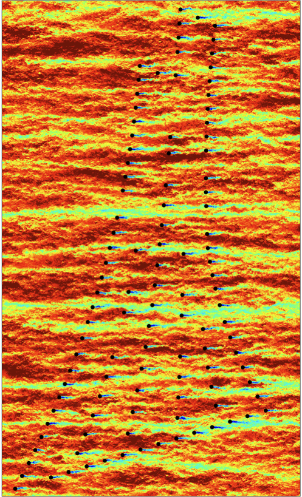
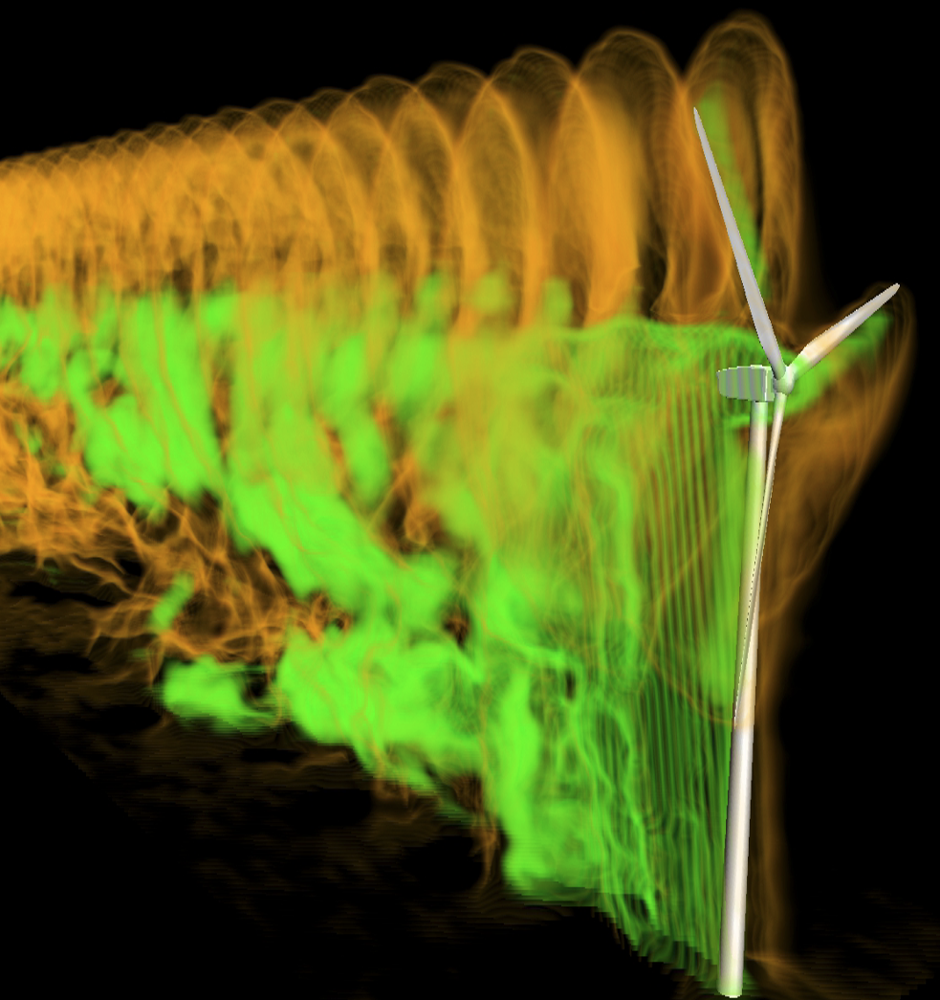
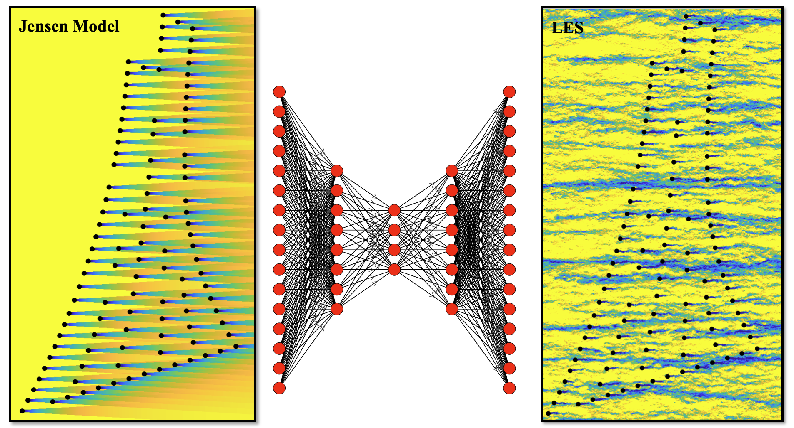
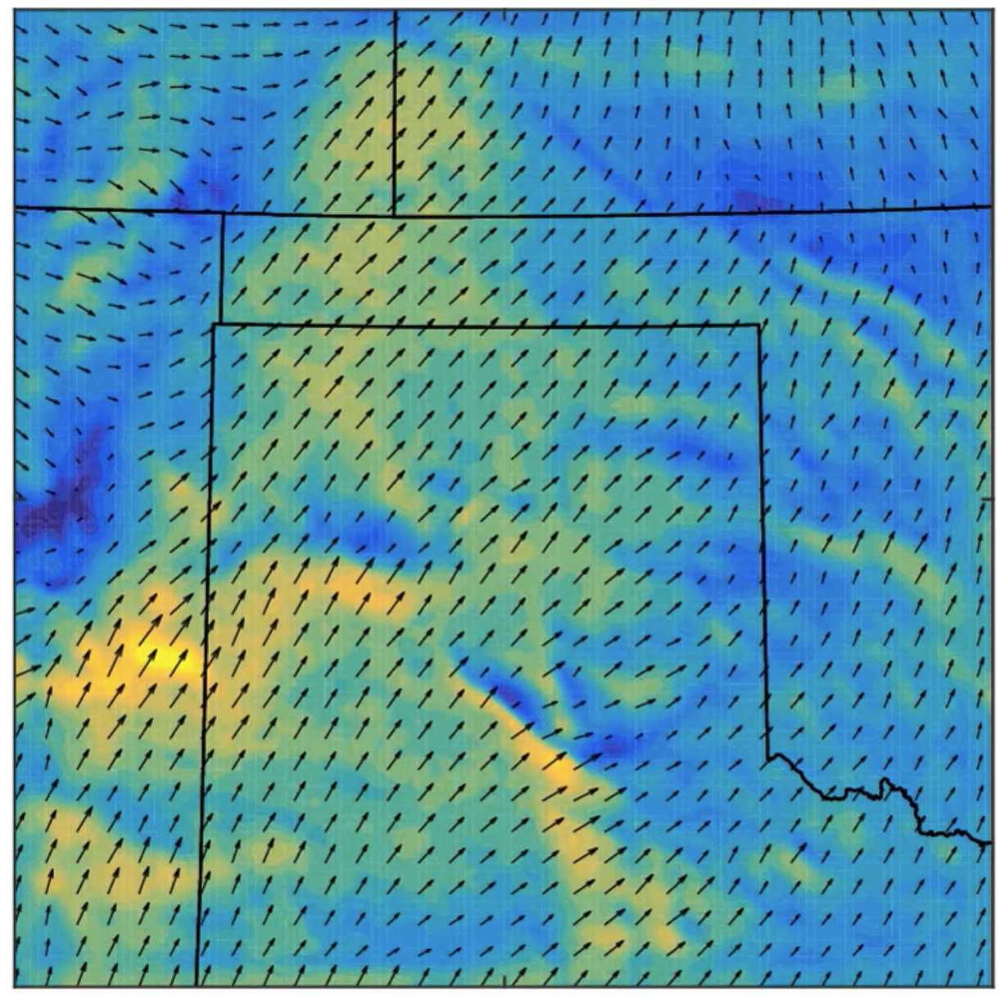

::: {.image-banner}

:::

::: {.content-section}

# Research Overview

The Advanced Computational Flow and Energy Lab develops computational and data-driven methods for understanding, predicting, and controlling complex flow and energy systems. Our research combines high-performance computing, high-fidelity computational fluid dynamics, machine learning, and in-house scientific code development.

We are broadly interested in turbulent flows, energy transport, and coupled multiphysics systems across engineering, energy, environmental, and aerospace applications. Our computational work includes large-eddy simulation, reduced-order modeling, and data-driven approaches for complex flow systems.

## Focus

Our group uses physics-based modeling and data-driven methods to study complex flow systems across multiple scales. A central goal is to develop predictive tools that are accurate enough to capture important flow physics while remaining useful for engineering analysis, design, and decision support.

## Research Themes

- High-fidelity simulation of turbulent flows
- Wind energy, turbine wakes, and flow control
- Machine learning for computational fluid dynamics
- Environmental and atmospheric flows
- Wildland fire and fire-atmosphere modeling
- High-performance computing and in-house scientific software development

:::

::: {.content-section}

# Selected Research 

::: {.research-grid}

::: {.research-card}

### High-Fidelity Simulation of Turbulent Flows

We use large-eddy simulation, and advanced computational fluid dynamics methods to study turbulent flows and energy transport. These simulations provide detailed insight into flow physics and generate high-quality data for model development and validation.
:::

::: {.research-card}

### Wind Energy and Flow Control

We study turbine wake dynamics, wake interactions, atmospheric boundary layer effects, and the influence of local topography on wind energy systems. This work supports improved wind farm design, wake steering, turbine control, and fluid-structure interaction modeling.
:::

::: {.research-card}

### Machine Learning for Flow Modeling

We develop machine learning models that complement physics-based simulations. These methods are used to create reduced-order and surrogate models for predicting flow fields, turbulence quantities, wake dynamics, and coupled multiphysics behavior.
:::

::: {.research-card}

### Environmental and Fire-Atmosphere Flows

We investigate atmospheric and environmental flow systems where turbulence, terrain, surface heterogeneity, and transport processes play important roles. Current directions include near-surface flow prediction, coupled fire-atmosphere modeling, and multiscale environmental flow simulation.
:::

:::

:::

